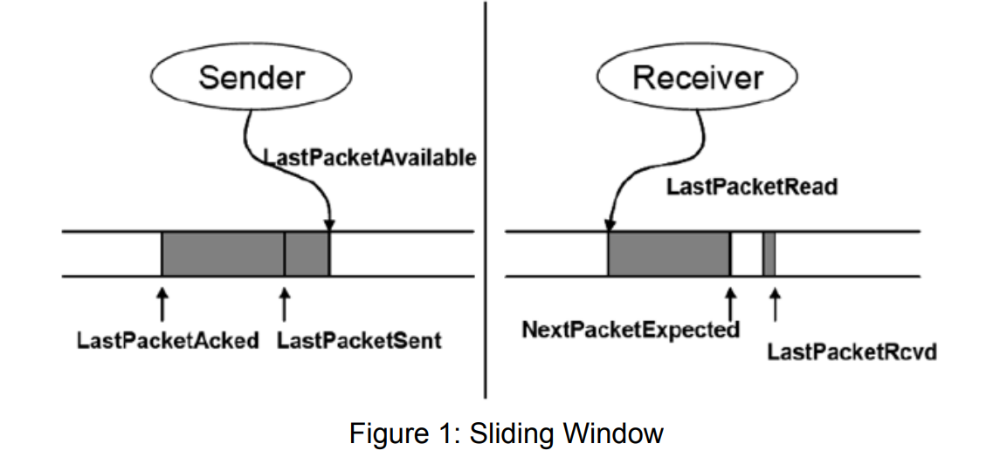

# Transmission-Control-Protocol-TCP

The objective of this project is to build TCP from scratch. The project is divided into two tasks:
reliable data transfer and congestion control. 
Before beginning the project, make sure to read the entire project description carefully. This will
help to understand the provided functionality and the features that are implemented.

### Task 1: Simplified TCP Sender/Receiver
For the first task, the goal is to create a "Reliable Data Transfer" protocol. The objective is to develop a simplified TCP sender
and receiver that can manage packet losses and retransmissions.
The implementation of the protocol requires the following functionalities:
- Sending packets to the network based on a fixed sending window size. The window size is set to 10 packets.
- Sending cumulative acknowledgments from the receiver and determining how to
respond to them at the sender.
- Using a single retransmission timer to handle packet loss and retransmission.

In short, the approach used for implementing the first task is similar to the Go-Back-N protocol.
Both use cumulative acknowledgments and a single timeout timer for the oldest
unacknowledged packet. However, in this approach, only the packet with the smallest sequence
number in the window is retransmitted upon a timeout, as opposed to the entire window in the
Go-Back-N protocol.

At the receiver, out-of-order packets must be buffered and cumulative acknowledgments are
sent for out-of-order packets. When a packet is lost, the packet must be retransmitted by the
sender using a retransmission timeout timer (RTO) with a fixed timeout value that is suitable for
the emulated network scenario using MahiMahi. When an ACK is received that acknowledges a
transmitted packet, the retransmission timer is restarted so that it will expire after the fixed
timeout value. 

The sender should terminate upon successfully transmitting the entire file, including receiving an
acknowledgment for the very last packet.

The code consists of the following:
- rdt receiver: this holds the implementation of a simple reliable data transfer protocol (rdt)
receiver.
- rdt sender: this holds the implementation of a simple reliable data transfer protocol (rdt)
sender.
- Channel traces for emulating different network conditions

The simple rdt protocol is implemented on top of the UDP transport protocol. During the lab
session, the TA showed you how to use the network emulator MahiMahi to test your sender and
receiver functionality in an emulated network environment.
#### Sliding Window
The sender and the receiver have to maintain a sliding window, as shown in Figure 1.

The sender slides the window forward when it receives an ACK for a packet with the lowest
sequence number in the sliding window. There is a sequence number associated with each
packet and the following constraints are valid for the sender:
1. LastPacketAcked <= LastPacketSent
2. LastPacketSent <= LastPacketAvailable
3. LastPacketSent - LastPacketAcked <= WindowSize
4. Packets between LastPacketAcked and LastPacketAvailable must be “buffered”. You
can either implement this by buffering the packets or by being able to regenerate them
from the data file.

After the sender sends a data packet, it starts a timer (if it is not already running) and waits for a
certain period to receive an acknowledgment for the packet. Meanwhile, whenever the receiver
receives a packet, it responds with an ACK for the NextPacketExpected (cumulative ACK). If the
receiver receives an out-of-order packet, it should buffer the packet and send a duplicate ACK.
For example, upon receiving a packet with sequence number = 100, the reply would be “ACK
101”, but only if all packets with sequence numbers less than 100 have already been received.
These ACKs are called cumulative ACKs. The sender has two ways to know if the packets it
sent did not reach the receiver: either a timeout occurred, or the sender received “duplicate
ACKs”.

If the sender sent a packet and did not receive an ACK for it before the timer expired, it
retransmits the packet. If the sender sent a packet and received duplicate ACKs, it knows that
the next expected packet (at least) was lost. To avoid confusion from reordering, a sender
counts a packet lost only after 3 duplicate ACKs in a row.

### Task 2: TCP Congestion Control
Task 2 involves implementing a congestion control protocol for the sender and receiver
developed in Task 1, similar to TCP Tahoe. The congestion control protocol should include the
following features:
- Slow-start
- Congestion avoidance
- Fast retransmit (without fast recovery)

The next subsections detail the requirements of the assignment. This high-level outline roughly
mirrors the order in which you should implement the functionality. 

#### Retransmission Timer
Task 1 assumed a fixed value for the retransmission timeout timer (RTO). In task 2, the duration
of the timeout timer should be determined based on the Round Trip Time (RTT) estimator
explained in the lecture and in RFC 2988. The RTO should include Karn's algorithm and also
implement an "exponential backoff" for successive timeouts for the same segment. The
following values should be used to initialize the RTT estimation parameters:
- RTT: 0 seconds
- RTO: 3 seconds

The upper bound for the RTO is 240 seconds and may be used to provide an upper bound for
the exponential backoff.

#### Congestion Control
Broadly speaking, the idea of TCP's congestion control is to determine how much capacity is
available in the network, so it knows how many packets it can safely have “in-flight” at the same
time. Once the sender has this many packets in transit, it uses the arrival of an ACK as a signal
that one of its packets has left the network, and it is therefore safe to insert a new packet into
the network without adding to the level of congestion.

TCP is considered to be "self-clocking" because it uses acknowledgments to regulate the rate at
which packets are transmitted. In addition, TCP incorporates a congestion control mechanism
that comprises several algorithms, including Slow Start, Congestion Avoidance, Fast
Retransmit, and Fast Recovery. You can read more about these mechanisms in the textbook
Section 3.7. In the first part of the project, the window size was fixed to 10 packets. The task of
the second part is to dynamically determine the ideal congestion window size (CWND) of the
sender.

**Slow-start**: When a new connection is established with a host, the CWND is initialized to one
packet. Each time an ACK is received, CWND is increased by one packet. The sender keeps
increasing CWND until the first packet loss is detected or until CWND reaches the value
ssthresh (Slow-start threshold), after which it enters Congestion Avoidance (see below). For a
new connection, the ssthresh is set to a very large value, i.e. 64 packets. If a packet is lost in
the slow-start phase, the sender sets ssthresh to max(CWND/2, 2) in case the client later
returns to Slow-start again.

**Congestion Avoidance** slowly increases CWND until a packet loss occurs. The increase of
CWND should be at most one packet per round-trip time (regardless how many ACKs are
received in that RTT). That is, when the sender receives an ACK, it usually increases CWND by
a fraction equal to 1/CWND. You may notice here that you need to use a float variable for the
CWND, however when you send data you are always going to take the floor of the CWND. As
soon as the entire window is acknowledged, only then these fractions would sum to a 1.0 and
as a result the CWND would then have increased by 1 packet. This is in contrast to Slow-start
where CWND is incremented for each ACK. Recall that when the sender receives 3 duplicate
ACKs, it can be assumed that the packet with sequence number == acknowledgment number
was lost, even if a timeout has not occurred yet. This process is called Fast Retransmit.

**Fast Retransmit**: Once a Fast Retransmit occurs, the ssthresh is set to max(CWND/2, 2).
CWND is then set to 1 and the Slow-start process starts again. Please note that implementing
the fast recovery mechanism is not required for this project.

#### Graphing CWND
As part of the sender implementation, you are required to generate an output file called
"CWND.csv", which tracks how the congestion window (CWND) varies over time. This file
serves both as a debugging tool for testing your code and as a means for us to grade your
submission. The file should include the time when the window changed and the current value of
the CWND. To facilitate grading, you should also update the plotting script (plot.py) to
graphically depict the evolution of the CWND over time.

### Further Implementation Details
Please note the following implementation details for both tasks:
- The handshake procedures of TCP (connection establishment and termination), flow
control, and fast recovery do not need to be implemented.
- Please note that the setup of sender and receiver in this project does not reflect a real
world scenario. For simplicity, in this project, the receiver must be started first and the
sender second. Once the sender is started, it will begin sending the file to the receiver. In
a real world scenario, the sender would act as the server and the receiver as the client.
Furthermore, the client would request a file from the server (typically using the
application layer) and wait for the incoming file.
- To avoid overwriting the sending file with the receiving file, ensure that you either give
the output file at the receiver a different name or run the sender and receiver code in two
different folders.
- The sliding window should have a maximum size of a 32 bit integer and wraps around.
- Delayed ACK's do not need to be implemented.
- Sequence and acknowledgment numbers are based on bytes, rather than on discrete
packet numbers.

